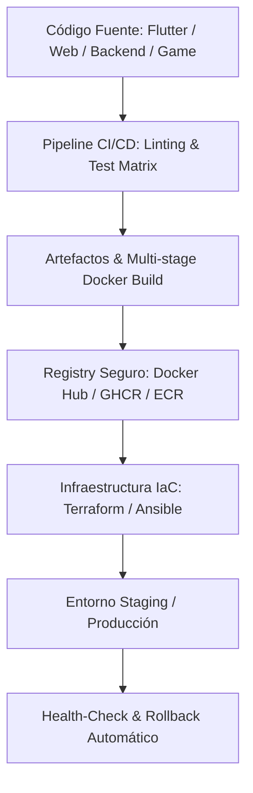

# 🏗️ Infra Agent Skill (Transversal)

> **Habilidad Transversal de Infraestructura, CI/CD, Containerización y Despliegue Agnóstico** para Agentes de Inteligencia Artificial (Antigravity, Cursor, Claude, OpenAI, Gemini).

Designed to be **100% agnostic** across all application types (**Flutter, Web, Game, Backend**).

---

## 📌 Propósito y Alcance

`infra-agent-skill` dota a los agentes de IA de capacidades avanzadas para auditar, diseñar, optimizar y automatizar la infraestructura del proyecto:

1. **📦 Containerización**: Docker multi-stage builds optimizados por capa, reduciendo tamaño final de imagen y maximizando caché de dependencias.
2. **🔄 Pipelines CI/CD**: Automatización con GitHub Actions / GitLab CI para validación de sintaxis, pruebas unitarias, build de binarios/contenedores y despliegue continuo.
3. **🌐 Infraestructura como Código (IaC)**: Módulos idempotentes de Terraform / Ansible para provisionamiento en la nube (GCP, AWS, Azure, DigitalOcean, VPS).
4. **🚀 Estrategias de Despliegue**: Rollout progresivo, Blue/Green, Canary, estrategias de rollback automático y monitoreo post-deploy.
5. **🛡️ Gestión de Secretos e Infraestructura Segura**: Aislamiento de variables de entorno, rotación de credenciales y hardening de entornos.

---

## ⚡ $-Comandos de Infraestructura

| Comando | Acción | Descripción |
|---|---|---|
| `$infra` | **Bootstrap Infra** | Carga el contexto de infraestructura y analiza la postura actual del proyecto. |
| `$infra:check` | **Diagnóstico** | Ejecuta scripts de salud, auditando Dockerfiles, pipelines y archivos de IaC. |
| `$infra:docker` | **Containerizar** | Genera o refactoriza Dockerfiles multi-stage optimizados para la plataforma activa. |
| `$infra:cicd` | **Pipeline CI/CD** | Construye o mejora workflows de CI/CD con pruebas, linting y artifact packaging. |
| `$infra:iac` | **Provisionamiento** | Crea/actualiza manifiestos Terraform/Ansible con estado remoto seguro. |
| `$infra:deploy` | **Plan de Despliegue** | Diseña e inspecciona la estrategia de despliegue con checklist pre y post-flight. |

---

## 🧩 Arquitectura Transversal



---

## 📦 Instalación como Submódulo Git

> ⚠️ **Regla de Ubicación Obligatoria**: Las skills se instalan **únicamente** dentro del directorio `.skill/` en la raíz del proyecto huésped (a la misma altura que `.agents/`). **NUNCA** se deben colocar dentro de `.agents/`, la cual está reservada exclusivamente para el repositorio oficial de gobernanza (`*-agent-rules`).

```bash
# 1. Crear el directorio contenedor .skill/ en la raíz del proyecto (si no existe)
mkdir -p .skill

# 2. Agregar la skill como submódulo Git (usando el nombre completo del repositorio)
git submodule add https://github.com/xolotl-hub/infra-agent-skill.git .skill/infra-agent-skill
```

Para activar en la sesión actual:
```text
$infra
```
