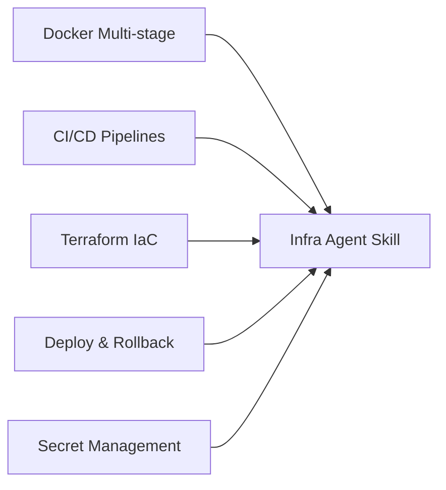

# ⚙️ Infra Agent Skill Matrix & Directives

## 🎯 Capacidades de la Habilidad



---

## 📋 Protocolo de Diagnóstico de Infraestructura (`$infra:check`)

Al ejecutar `$infra:check`, el agente debe auditar los siguientes vectores:

1. **Docker check**:
   - ¿Existe `Dockerfile`? ¿Usa construcción en etapas (`FROM ... AS builder`)?
   - ¿Las capas de dependencias se copian e instalan antes del código fuente?
   - ¿El usuario de ejecución es no-root (`USER nonroot` / `USER node` / `USER app`)?
2. **CI/CD check**:
   - ¿Existe `.github/workflows/` o `.gitlab-ci.yml`?
   - ¿Se auditan dependencias y sintaxis en cada Pull Request?
   - ¿Se usan secrets encriptados para tokens y llaves de acceso?
3. **IaC check**:
   - ¿Se guardan estados de Terraform en backend remoto con locking (S3/DynamoDB/GCS)?
   - ¿Las variables sensibles están marcadas como `sensitive = true`?

---

## 🏗️ Patrón Canónico de Containerización Multi-Stage (Agnóstico)

```dockerfile
# Etapa 1: Construcción y Compilación
FROM base-image:tag AS builder
WORKDIR /app
COPY package*.json / pubspec.* / requirements.txt ./
RUN <install-dependencies-command>
COPY . .
RUN <build-production-binary-command>

# Etapa 2: Imagen Final Minimalista de Producción
FROM alpine:3.19 OR distroless AS runner
WORKDIR /app
RUN addgroup -S appgroup && adduser -S appuser -G appgroup
COPY --from=builder /app/dist /app/bin /app/
USER appuser
EXPOSE 8080
HEALTHCHECK --interval=30s --timeout=3s --retries=3 \
  CMD curl -f http://localhost:8080/health || exit 1
ENTRYPOINT ["/app/binary-or-server"]
```

---

## 🔄 Protocolo de Despliegue Seguro

1. **Pre-flight**:
   - Verificar compilación exitosa en CI.
   - Pasar suite completa de pruebas unitarias/integración.
   - Verificar sintaxis de configuración del entorno objetivo.
2. **Execution**:
   - Aplicar cambios en entorno de staging antes de producción.
   - Ejecutar migraciones idempotentes de esquema/base de datos.
   - Desplegar contenedor o binario con estrategia Zero-Downtime.
3. **Post-flight**:
   - Monitor de salud durante 120 segundos en `/health`.
   - Si se detecta status 5xx o fallos en health check, gatillar `rollback` de inmediato.
